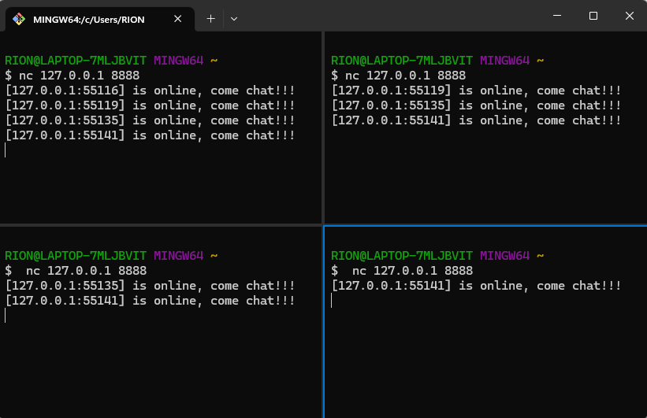
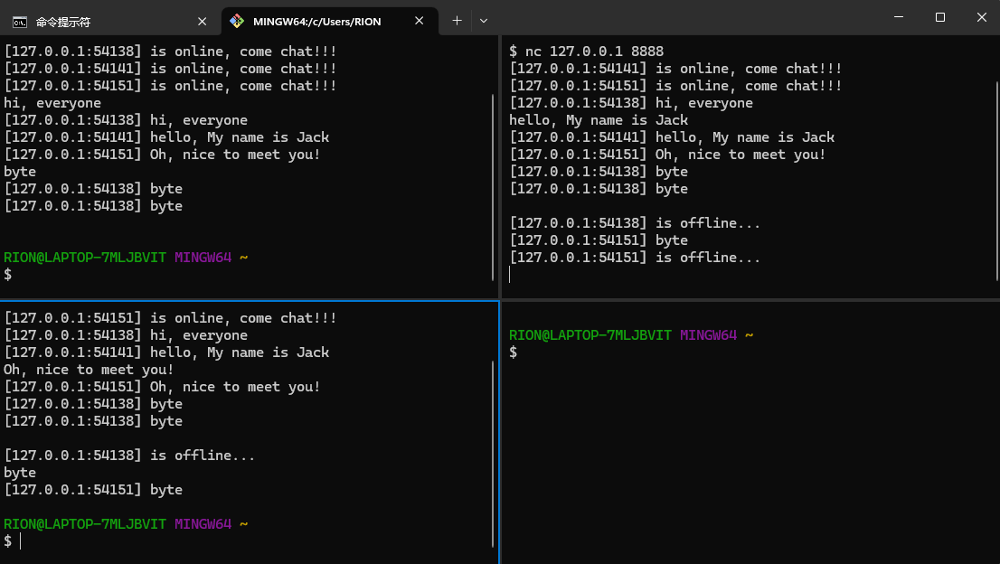

# 一、IM-System 即时通信系统
> 课程地址： https://www.bilibili.com/video/BV1gf4y1r79E?
> 
> 课程大纲： https://www.yuque.com/aceld/mo95lb/ks1lr9#nNVKO

# 二、各阶段版本演示效果

- **版本二**

主要实现了一个全局广播，用来通知用户上线和下线等消息。

- **版本三**

给每个handler增加一个接收client消息的func，然后将消息进行全局广播。
其实有些像群聊功能。

